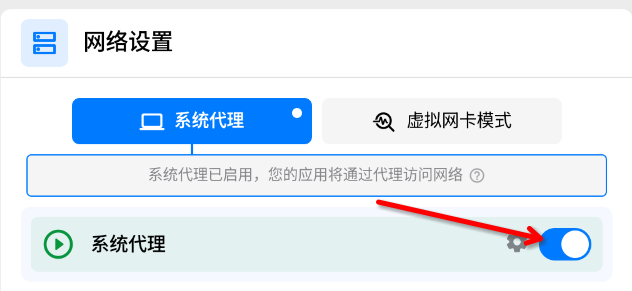

# Clash Verge 安装与使用

Clash Verge 是一款跨平台的图形化代理客户端，基于 Clash.Meta 核心开发，支持 Windows、macOS 和 Linux 系统。它继承了 Clash 的高性能和灵活性，支持多种代理协议，如 Shadowsocks、VMess、Trojan、Tuic、Hysteria 等，兼容各类机场订阅。Clash Verge 提供现代化的用户界面，配置方式友好，支持多语言、自动订阅更新、节点筛选、分流规则管理等功能。得益于 Meta 内核的增强，Verge 支持更丰富的协议特性与策略组配置，是高级用户与跨境办公场景中的优选工具。本文在Linux上讲述如何安装和使用Clash Verge。

- [Clash verge 官网](https://getclashvergerev.org/)
- [Clash verge Github](https://github.com/clash-verge-rev/clash-verge-rev)

## Clash Verge 安装

```bash

# 对于 Redhat 系列 Linux 发行版（Centos, Fedora, AlmaLinux, Rocky Linux 等）, 可以使用 rpm 安装包进行安装

curl -L --output /tmp/clash-verge.rpm https://github.com/clash-verge-rev/clash-verge-rev/releases/download/v2.2.3/Clash.Verge-2.2.3-1.x86_64.rpm

sudo rpm -i /tmp/clash-verge.rpm

# debian 系列发行版（Ubuntu, Mint, MX, Kubuntu, Zorin 等等）, 可以使用 deb 安装包进行安装

curl -L --output  /tmp/clash-verge.deb  "https://github.com/clash-verge-rev/clash-verge-rev/releases/download/v2.2.3/Clash.Verge_2.2.3_amd64.deb"
apt-get install -y  /tmp/clash-verge.deb 

```

更多版本点击[这里](https://github.com/clash-verge-rev/clash-verge-rev/releases/)下载


## 导入订阅

先进行 [订阅购买](https://vip02.stableconnect.cloud/#/plan) ，获取到订阅链接。订阅链接位于：仪表盘 > 一键订阅 , 然后复制订阅地址或者扫描二维码订阅。


## 配置

开启系统代理，开启系统代理以后就不用为某个或某些应用配置代理。



现在浏览器可以打开 [google.com](https://www.google.com/) 了。

## 如何彻底卸载 Clash-verge

```bash

# 停止并禁用服务
sudo systemctl stop clash-core-service.service
sudo systemctl disable clash-core-service.service

# 删除服务文件
sudo rm -f  /usr/lib/systemd/system/clash-core-service.service


# 重新加载 systemd
sudo systemctl daemon-reload

# 删除软件
sudo dnf remove clash-verge

# 删除配置文件和缓存

rm -rf ~/.config/clash

rm -rf ~/.cache/clash-verge/

rm -rf ~/.local/share/clash-verge/

# 删除窗口状态文件
rm -rf ~/.config/io.github.clash-verge-rev.clash-verge-rev/
# Clash Verge配置文件
rm -rf ~/.config/io.github.clash-verge-rev.clash-verge-rev/verge.yaml
#配置(软件工作)目录：
rm -rf ~/.local/share/io.github.clash-verge-rev.clash-verge-rev/
#订阅(配置)文件目录：
rm -rf ~/.local/share/io.github.clash-verge-rev.clash-verge-rev/profiles/
#重启系统
sudo reboot
```

## 参考文档

- [CFW 使用](https://docs.mebi.me/docs/cfw-for-linux)
- [订阅导入](https://getclashvergerev.org/guide/profile)
